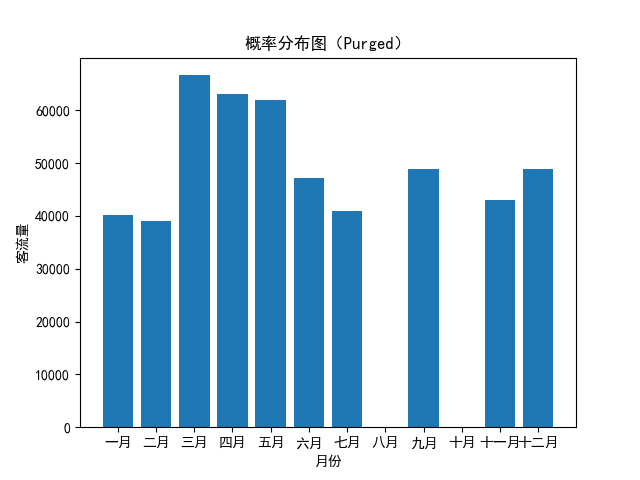
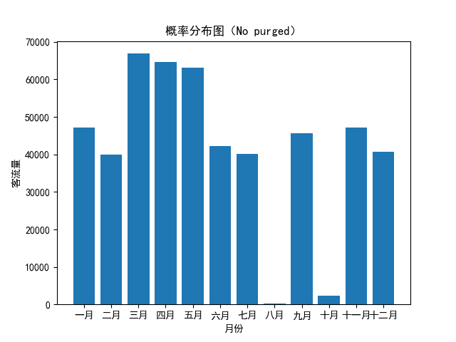

# 志伟分布

[](https://mybinder.org/v2/gh/kressety/yzw-distribution/main?labpath=main.ipynb)


# 理解问题  

> *让客流量随机分配在一年中的12个月里，但需要保证某几个月的客流量为0，而另外的几个月里客流量要显著高于其他的月份。*  

该问题实际上就是一个概率分布问题，只需要让客流量为0的月份里概率为0，而客流量较高的月份里概率更高即可。  
当然，关于**较高**是怎么个高法，我们仍然有办法去控制。  
以下给出上述算法实例。  

# 算法描述  

```math
\begin{array}{ll}
n : \text{总体值} & P_{\text{unit}} : \text{基础概率单位} = \frac{1}{W + p \times |H|} \\
Z : \text{客流量为0的月份的集合} &  P_i : \text{第}i\text{个月的概率} = \begin{cases} 
0 & \text{if } i \in Z \\
P_{\text{unit}} \times p & \text{if } i \in H \\
P_{\text{unit}} & \text{otherwise} 
\end{cases} \\
H : \text{客流量较高的月份的集合} & \Delta : \text{随机扰动量} = \text{Uniform}(-\delta, \delta) \\
p : \text{业绩参数} & P'_{i} : \text{施加扰动后的概率} = \begin{cases} 
P_i & \text{if Purging and } P_i = 0 \\
\text{Clip}(P_i + \Delta_i, 0, 1) & \text{otherwise} 
\end{cases} \\
\delta : \text{扰动参数} & P''_{i} : \text{归一化后的概率} = \frac{P'_{i}}{\sum P'_{i}} \\
\text{Purging} : \text{是否保持原为0的概率}&  
\end{array}
```

# 示例

|参数|值|
|---|---|
|total|500000|
|zero_months|[7, 9]|
|higher_months|[2, 3, 4]|
|performance|1.5|
|noise|0.01|

## Purged

> *原先概率是 0 的月，客流量永远是 0 。*
> |月份|客流量|月份|客流量|月份|客流量|
> |---|---|---|---|---|---|
> |一月|40127|二月|39088|三月|66629|
> |四月|63120|五月|62027|六月|47227|
> |七月|41014|八月|0|九月|48956|
> |十月|0|十一月|43003|十二月|48809|



## No purged

> *原先概率是 0 的月份，在扰动下客流量有可能大于 0 。*
> |月份|客流量|月份|客流量|月份|客流量|
> |---|---|---|---|---|---|
> |一月|47221|二月|39923|三月|66875|
> |四月|64636|五月|63019|六月|42227|
> |七月|40059|八月|138|九月|45690|
> |十月|2266|十一月|47225|十二月|40721|


